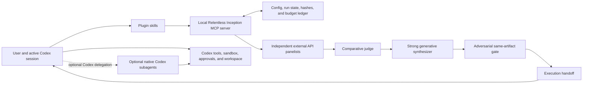

# Architecture

Relentless Inception is a Codex plugin that separates **deliberation** from **execution**. A local MCP server can ask several external models for independent analyses, compare them, produce a generative synthesis, and gate that synthesis. The active Codex session then decides whether and how to execute the resulting handoff under the user's normal workspace permissions.

The design goal is maximum useful intelligence without giving remote model responses ambient authority over the user's machine.

## System boundary

The arrow from the handoff returns to the active Codex session. It does not continue from the MCP server into the workspace.

## Components

### Codex plugin package

The installable plugin lives under `plugins/relentless-inception/`:

- `.codex-plugin/plugin.json` provides plugin metadata and points Codex to skills and MCP configuration.
- `.mcp.json` starts the local Python MCP server.
- `skills/` contains the user-facing orchestration, configuration, and review contracts.
- `config/default.json` and `schemas/config.schema.json` define the external-seat configuration surface.
- `relentless_inception/` implements configuration, provider adapters, orchestration, persistence, budgets, and execution handoffs.
- `examples/native-codex-*.toml.example` contains opt-in native Codex setup snippets.

Codex plugins can bundle skills and MCP servers, but the current plugin manifest does not install arbitrary native Codex agents. Native agents are separate TOML configuration layers. See the official [Codex plugin documentation](https://developers.openai.com/codex/plugins/build) and [subagent documentation](https://developers.openai.com/codex/multi-agent).

### MCP control plane

The MCP server exposes four groups of tools:

| Group | Tools | Purpose |
|---|---|---|
| Configuration | `config_show`, `config_schema`, `config_get`, `config_set`, `config_validate` | Display and safely update redacted plugin settings. |
| Capability | `doctor`, `provider_models`, `provider_test` | Verify local state, discover live model ids, and probe seats. |
| Deliberation | `fuse`, `adversarial_gate` | Run independent panels, comparison, synthesis, and evidence gates. |
| Lifecycle | `run_status`, `run_abort`, `execution_handoff` | Inspect or stop runs and recover a previously produced handoff. |

The tool schemas returned by the running server are the authoritative argument contract.
The same redacted views are available as MCP resources at `relentless-inception://config`, `relentless-inception://schema`, and `relentless-inception://doctor` for clients that render resources more naturally than tool output.

### Enforcement layers

The configuration schema is intentionally broader than one Python function because several controls belong to the Codex host:

| Layer | Enforces |
|---|---|
| MCP runtime | Provider credentials and calls, normalized responses, panel liveness, judge/verdict structure, artifact hashes, reviewer quorum, core call/token/known-cost/time budgets, run confinement, and kill checks. |
| Codex skills and active session | Goal/scope confirmation, path selection and redaction before egress, acceptance criteria, mechanical evidence collection, active-workspace execution, approvals, diff review, and post-execution submission. |
| Native Codex runtime | Actual subagent availability, model/provider selection, inherited tools, sandbox, permission mode, and native tool-loop compatibility. |
| Provider/router | Upstream retention, model availability, routing, usage reporting, and remote cancellation behavior. |

A setting in `native_codex`, `privacy`, `evidence`, or `execution` does not grant the MCP process Codex permissions. It gives the host skill an explicit policy to follow and audit.

### Provider adapters

External seats are normalized into one `ModelResponse` shape containing requested model, actual model, provider, route metadata, latency, usage, and response text. The current transport contracts are:

- xAI Responses;
- OpenAI Responses;
- Anthropic Messages;
- OpenAI-compatible Chat Completions;
- OpenRouter Chat Completions;
- OpenRouter's optional Fusion plugin path.

An unsupported proprietary protocol is not made compatible by changing its provider name. Provider behavior and limitations are detailed in [PROVIDERS.md](PROVIDERS.md).

### Run state and budgets

The MCP server stores run artifacts beneath `PLUGIN_DATA` when Codex supplies it, `RELENTLESS_INCEPTION_DATA_DIR` when explicitly set, or `~/.codex/relentless-inception/` as the fallback. A run directory is keyed by a generated run id and binds:

- a SHA-256 of the task;
- a redacted configuration hash;
- stage status and artifact names;
- requested and actual model provenance;
- token and known-cost accounting;
- count of calls for which cost was unknown;
- raw external responses needed for evidence, synthesis, and deterministic resume;
- the fused result, gate result, and execution handoff.

Resume refuses a run id when the task or configuration hash differs. Runtime directories are private (`0700`), files are private (`0600`), writes are atomic, and artifact paths are confined to the run directory. Constructed outbound prompts and hidden reasoning are not persisted as separate artifacts, but raw model responses are. A global or per-run `KILL` file aborts later stages; `run_abort` is the user-facing control.

## Deliberation pipeline

### 1. Map

The active Codex session constructs a bounded packet containing the task, acceptance criteria, constraints, and the smallest sufficient evidence bundle. All artifact content is fenced as untrusted data.

### 2. Independent panel

Panel seats receive the same core task before seeing another seat's response. Diversity should come from model/provider families, roles, and context partitions—not merely sampling temperature. Each response must stand alone and distinguish evidence, inference, uncertainty, edge cases, and verification work.

The server may run seats concurrently within configured provider and profile limits. A failed or missing seat stays visible. If the panel drops below `min_live_seats`, the run fails closed.

### 3. Comparative judge

The judge sees anonymized panel reports and produces structured diagnostics:

- consensus supported by evidence;
- contradictions;
- partial coverage;
- unique insights;
- minority findings;
- blind spots;
- verification priorities;
- guidance for synthesis.

The judge does not choose a winner or write the final answer. This allows an economical judge without making it the quality bottleneck.

### 4. Generative synthesis

The synthesizer receives the original task, raw panel reports, judge diagnostics, and supplied mechanical evidence. It writes a new coherent answer or plan. It must resolve contradictions by evidence and preserve supported lone-minority findings.

Majority voting and score averaging are explicitly prohibited. Repetition across correlated models is not proof. This design follows the user's [TrustedRouter fusion artifact](https://github.com/ahuserious/trustedrouter-fusion-artifact): retain raw independent evidence, use an economical comparison stage, and spend the strongest suitable model on generative synthesis.

### 5. Adversarial gate

Independent verifier seats try to falsify the exact candidate artifact. A gate binds its verdict to the candidate SHA-256. Missing evidence, schema failure, a reproducible mechanical failure, or insufficient live reviewers blocks a pass.

The default maximum-intelligence policy requires a same-artifact quorum: two independent verifier seats must each return `PASS` for the identical candidate SHA-256. This is not two sequential whole-gate rounds. A higher-level release workflow may additionally run the complete gate twice on an unchanged commit hash. Plan, pre-execution, post-execution, final, and summary checkpoints can use the same primitive with stage-specific evidence requirements.

### 6. Execution handoff

The MCP server returns an `execution_handoff` containing the verified synthesis, constraints, unresolved minority findings, required checks, and remaining budget information. Its default backend is the **active Codex session**.

The active session then:

1. re-inspects the real workspace;
2. applies repository instructions and current user scope;
3. requests approvals through Codex when needed;
4. edits with ordinary Codex tools;
5. runs mechanical checks;
6. submits the resulting exact artifact to a post-execution gate.

The handoff is advice plus an evidence contract. It is not an instruction that bypasses newer user input, repository reality, or permissions.

## Execution authority

| Actor | Sees local workspace by default | Can run local tools | Can request approvals | Can write files |
|---|---:|---:|---:|---:|
| External API panelist | No | No | No | No |
| Judge or synthesizer API seat | No | No | No | No |
| Relentless Inception MCP server | Only explicit local config/run data and content sent by Codex | Its own bounded provider/state operations | No interactive Codex approval authority | Only plugin/run configuration and state |
| Active Codex session | Yes, within sandbox | Yes | Yes | According to sandbox and user scope |
| Native Codex subagent | According to inherited tools and sandbox | Yes | Only where the runtime can surface approval; otherwise approval-required actions fail | According to inherited/effective sandbox |

This distinction is central. Describing an API panelist as a "Grok subagent" would be misleading. A true Grok-powered Codex subagent requires an opt-in Codex provider and custom-agent configuration that passes a compatibility test.

## Optional native Codex agents

Codex loads personal custom agents from `~/.codex/agents/` and project agents from `.codex/agents/`. Custom agent files are session configuration layers and can select a model, reasoning effort, provider, sandbox, MCP servers, and instructions. The parent turn's live permissions remain authoritative.

Provider definitions and credentials are machine-local configuration. Codex ignores `model_provider` and `model_providers` in project-scoped `.codex/config.toml`, so direct xAI, OpenRouter, or trusted-router definitions must be merged into user-level `~/.codex/config.toml`. No plugin install should do that silently. See [PROVIDERS.md](PROVIDERS.md) and the examples directory.

The native path has a stronger capability than an external panelist: if the provider is sufficiently Responses-compatible, the model participates in Codex's tool loop and Codex executes requested tools under its sandbox. That compatibility must be tested with streaming and a two-turn function-call continuation, not inferred from a successful text completion.

## Failure, degradation, and recovery

- Network, authentication, quota, schema, and semantic failures are recorded per seat.
- Retries are bounded. Repeated open-ended debate is not a recovery strategy.
- Optional seats can fail without erasing their failure, but the configured minimum live panel still applies.
- Model fallback requires explicit seat/profile permission and retains requested-versus-actual provenance.
- Budget exhaustion stops and reports; it does not silently lower quality or continue unmetered.
- `run_status` is the source of truth for a persisted run. A task/config hash mismatch prevents accidental resume into the wrong mission.
- This release does not promise an always-running watchdog or unattended daemon. Continued Codex execution still depends on the active task and its normal lifecycle.

## Design lineage

The Codex implementation keeps the strongest ideas from the user's prior systems while dropping host-specific assumptions:

| Source | Preserved idea | Codex adaptation |
|---|---|---|
| Claude/Grok Relentless Inception | Plan/phase/summary gates, persistent evidence, rescue-oriented checkpoints | MCP run state plus explicit active-Codex handoffs; no unverified TUI relay or hook claim. |
| Batch Create Eval | Decomposition, per-unit verification, simulated-user shakedown | The active Codex session owns work units and real tests. |
| Gigaprompt | Evidence bar, context preservation, repeated adversarial checks | Hash-bound reviewer quorums, with optional repeated whole-gate release rounds. |
| Exaflop | Cross-persona divergence and hard resource guards | Configurable seats and profiles with bounded calls, tokens, time, and dollars. |
| TrustedRouter fusion artifact | Strong synthesizer, economical judge, minority preservation | Client-orchestrated panel → judge → synthesizer, with optional routed seats. |

## Deliberate limitations

- External seats do not browse, use MCP tools, run shell commands, or inspect files unless the active Codex session first supplies the resulting evidence.
- Provider-advertised capabilities in configuration are descriptive; the current external-seat loop is text/structured-output deliberation, not unrestricted remote tool execution.
- Plugin install does not install API keys, user-level Codex providers, or custom agents.
- OpenRouter/trusted-router upstream selection can weaken independence unless routing is constrained and recorded.
- A multi-model verdict is still fallible. Mechanical tests and user authority remain higher-order controls.
