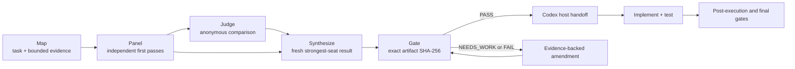

# Fusion Deliberation in Codex

Relentless Inception turns a difficult Codex task into an evidence-bearing sequence of independent proposals, structured comparison, fresh synthesis, exact-artifact review, and host-controlled execution. The runtime supplies the control plane; Codex remains the only default surface with workspace authority.

## Pipeline

1. **Map** — Codex supplies the goal, constraints, evidence, deterministic checks, and explicit context boundaries. External seats never discover the workspace on their own.
2. **Panel** — each seat answers independently before seeing another report. Personas and context lenses target different failure modes; genuinely disjoint data must be pre-partitioned by the host.
3. **Judge** — one structured pass identifies consensus, contradictions, partial coverage, unique insights, minority findings, blind spots, and final guidance. It does not select a winner or author the result.
4. **Synthesize** — a fresh seat sees the original task, raw reports, checks, and judge guidance and writes a new result. Raw reports remain primary evidence.
5. **Gate** — independent reviewers evaluate the exact synthesis hash and mechanical evidence. Any completed `NEEDS_WORK` or `FAIL` blocks, even if a numeric pass quorum would otherwise be met.
6. **Execute** — the runtime produces a hash-bound packet. The active Codex session must still complete enabled plan and pre-execution gates before mutation, then owns implementation, approvals, tests, diff review, and later lifecycle gates.

## Maximum-intelligence topology

| Role | Shipped selection | Authority |
|---|---|---|
| Active host and execution handoff | `gpt-5.6-sol`, `xhigh` | Workspace, tools, approvals, implementation, tests |
| Required independent panel | three direct-xAI `grok-4.5` seats at `high` with researcher, adversary, and constraint-auditor lenses | Bounded external packet only |
| Comparative judge | direct-xAI `grok-4.5` at `high` | Structured diagnosis only |
| Synthesizer | direct-xAI `grok-4.5` at `high` | Fresh fused artifact; no workspace access |
| Exact-artifact reviewers | direct-xAI `grok-4.5` verifier and constraint-auditor seats | Verdicts over a bound hash |
| Optional diversity | OpenAI, Anthropic, OpenRouter, native OpenRouter Fusion, or compatible trusted-router seats | Disabled until explicitly configured |

There is no automatic weaker-model fallback in `maximum_intelligence`. A missing required seat, schema-invalid output, unknown blocking cost, panel collapse, or failed gate stops the run visibly. Grok-only external seats are role-diverse multi-agent deliberation; cross-model fusion requires a separately configured model family. The GPT-5.6 Sol host does contribute a different family to the overall plan-and-execute workflow, but its host reasoning is not falsely counted as an external panel receipt.

## Why synthesis is not voting

Voting assumes independently calibrated choices and rewards the majority. A review panel is different: one adversarial seat may be the only participant to find a real failure. The runtime therefore:

- preserves every initial response;
- hides model identity from comparative judgment and randomizes panel order;
- prohibits majority vote and score averaging;
- gives synthesis both raw reports and structured diagnosis;
- requires supported minority findings to remain visible until evidence resolves them;
- forbids open-ended debate loops and allows only bounded, targeted escalation.

The original TrustedRouter research motivated spending capability on synthesis and treating temperature as a poor substitute for meaningful model, persona, and evidence diversity. This release still uses Grok 4.5 for the default judge because the operator selected smartest-model-only defaults; judge cost/capability remains configurable rather than silently downgraded.

## Reading the lineage screenshots

The following captures come from the original Claude Code edition. They document the user-facing mental model that this Codex runtime preserves, not the current Codex UI or default model names.

The first capture shows a `prd-gap-fusion-plan` gate being invoked with the original host session on Fable 5:

The second shows `Map` and `Panel` complete while `Fuse` is running. In that ancestor, the Fuse phase displayed a low-effort Fable judge and an xhigh Fable session fuser:

For this Codex edition, translate those labels as follows:

| Original capture | Codex runtime equivalent |
|---|---|
| Claude Code session | active Codex `gpt-5.6-sol` host |
| Map | host-built task/evidence packet passed to `fuse` |
| Panel | configured independent provider seats, direct Grok 4.5 by default |
| Judge | structured `grok45_judge` response |
| Fuser | fresh `grok45_synthesizer` result |
| downstream gate | `adversarial_gate` over the exact artifact SHA-256 |

## Gates across the lifecycle

The profile exposes five stages rather than the ancestor's three broad checkpoints:

| Stage | What it protects |
|---|---|
| Plan | requirements trace and risk analysis before accepting the fused plan |
| Pre-execution | approved plan and scope boundaries before workspace mutation |
| Post-execution | actual diff, tests, and requirement coverage |
| Final | gate verdict, cost ledger, and provenance before completion |
| Summarize | decisions, open risks, and verification state during handoff or compaction |

Each stage is host-invoked because only Codex can collect local evidence. The MCP runtime enforces the reviewer roster, quorum, hash identity, structured verdicts, amendment bounds, receipts, and budget state.

## Receipts, cost, and resume

Every reusable provider result is linked to a canonical invocation, reserved attempt, complete visible response, private raw artifact, and exact ledger entry. Resume accepts the result only if the receipt chain and semantic cache agree. HTTP success is not enough: empty, malformed, schema-invalid, or otherwise unusable responses are recorded and charged before any permitted fallback.

The runtime enforces call, token, reasoning-token, tool-call, provider-cost, total-cost, wall-time, and concurrency ceilings. A non-empty global or per-run `KILL` file prevents further dispatch. These local hashes detect mismatch and make resume fail closed; they are not cryptographic signatures against an attacker who can rewrite the entire private run directory.

## Configure the seats

Use `config_show` for the effective configuration, `config_schema` for every supported field, `config_get` for a path, and `config_set` for validated overrides. The authoritative model topology is `profiles.<name>.fusion`; seat definitions live under `seats`; providers live under `providers`; lifecycle review is under `profiles.<name>.gates`; costs and stopping conditions are under `profiles.<name>.budgets` and `profiles.<name>.rescue`.

Credentials are environment-variable references only. Run `doctor` after configuration, then use the opt-in `provider_models` and `provider_test` checks only when live/billable validation is intended. See [Configuration](CONFIGURATION.md) and [Providers and Models](PROVIDERS.md) for the complete field and transport reference.

## Proven and unproven

The limited-cost artifact proves one ten-call direct-xAI path with an amendment and a final 2/2 exact-artifact pass. It does not establish population-level quality gain, live acceptance for every optional provider, or successful DeepSWE integration. See [Release Evidence](RELEASE_EVIDENCE.md) and the immutable [Codex Fusion Artifact](https://github.com/ahuserious/codex-fusion-artifact/tree/limited-cost-2026-07-20).
